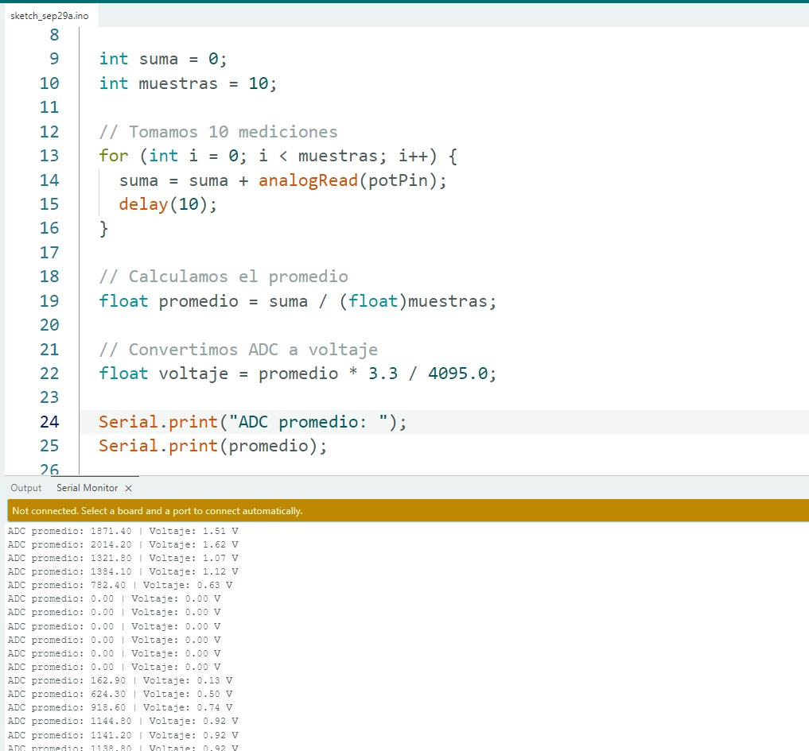
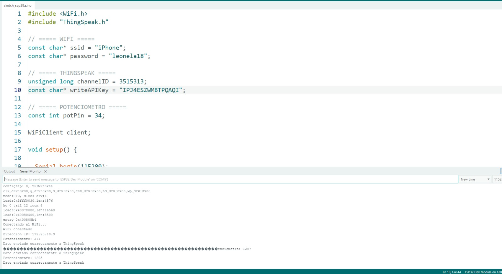

# Taller de Internet de las Cosas (IoT)

En este documento se presentan las cinco actividades desarrolladas con
el ESP32 durante el taller de Internet de las Cosas. El objetivo fue
comprender de forma práctica la lectura de entradas analógicas, la
conexión Wi-Fi y la comunicación entre el ESP32 y una plataforma IoT.
Para las actividades 3, 4 y 5 se utilizó **ThingSpeak**.

> **Nota:** Por seguridad, las contraseñas y API Keys reales fueron
> reemplazadas por valores de ejemplo en los códigos mostrados en este
> documento.

------------------------------------------------------------------------

## Actividad 1 -- Lectura de un potenciómetro, promedio y conversión a voltaje

### Objetivo

En esta actividad se mejoró la lectura de un potenciómetro conectado al
ESP32. En lugar de trabajar con una sola medición, se tomaron varias
muestras para calcular un promedio. Después, el valor obtenido del ADC
se convirtió a voltaje.

### Código utilizado

``` cpp
int potPin = 34;

void setup() {
  Serial.begin(115200);
}

void loop() {

  int suma = 0;
  int muestras = 10;

  // Tomamos 10 mediciones
  for (int i = 0; i < muestras; i++) {
    suma = suma + analogRead(potPin);
    delay(10);
  }

  // Calculamos el promedio
  float promedio = suma / (float)muestras;

  // Convertimos ADC a voltaje
  float voltaje = promedio * 3.3 / 4095.0;

  Serial.print("ADC promedio: ");
  Serial.print(promedio);

  Serial.print(" | Voltaje: ");
  Serial.print(voltaje);
  Serial.println(" V");

  delay(500);
}
```

### Explicación y pasos realizados

Primero conectamos el potenciómetro al ESP32 y usamos el pin **GPIO 34**
para realizar la lectura analógica. En el programa se realizan **10
mediciones** mediante `analogRead()` y cada lectura se va acumulando en
la variable `suma`.

Después se divide la suma entre la cantidad de muestras para obtener un
promedio. Esto permite que la lectura sea más estable que si
utilizáramos solamente un valor instantáneo.

Finalmente, convertimos el valor promedio del ADC a voltaje. Para ello
usamos como referencia los **3.3 V** del ESP32 y el rango de su ADC, de
**0 a 4095**. El resultado del ADC y el voltaje calculado se muestran en
el monitor serial.

### ¿Qué entendimos?

Con esta actividad entendimos cómo el ESP32 puede leer una señal
analógica y cómo podemos procesar esas mediciones antes de utilizarlas.
También vimos que realizar varias lecturas y obtener un promedio ayuda a
tener un valor más estable. Además, aprendimos a relacionar el valor
entregado por el ADC con un valor de voltaje que resulta más fácil de
interpretar.

### Evidencia



------------------------------------------------------------------------

## Actividad 2 -- Conexión del ESP32 a una red Wi-Fi

### Objetivo

El objetivo fue crear una red Wi-Fi mediante el hotspot de un celular,
conectar el ESP32 a esa red y comprobar la conexión mostrando en el
monitor serial la dirección IP asignada al dispositivo.

### Código utilizado

``` cpp
#include <WiFi.h>

const char* ssid = "NOMBRE_WIFI";
const char* password = "TU_PASSWORD";

void setup() {
  Serial.begin(115200);

  Serial.println();
  Serial.print("Conectando a: ");
  Serial.println(ssid);

  WiFi.begin(ssid, password);

  while (WiFi.status() != WL_CONNECTED) {
    delay(500);
    Serial.print(".");
  }

  Serial.println();
  Serial.println("¡Conectado al WiFi!");

  Serial.print("Direccion IP: ");
  Serial.println(WiFi.localIP());
}

void loop() {

}
```

### Explicación y pasos realizados

Primero incluimos la biblioteca `WiFi.h`, que permite utilizar la
conectividad Wi-Fi del ESP32. Luego colocamos el nombre de la red y su
contraseña.

Con `WiFi.begin()` iniciamos el intento de conexión. El ciclo `while`
mantiene al ESP32 esperando mientras no se haya conectado correctamente.
Durante ese tiempo se imprimen puntos en el monitor serial para indicar
que sigue intentando conectarse.

Cuando la conexión se completa, el programa muestra el mensaje de
confirmación y utiliza `WiFi.localIP()` para mostrar la dirección IP que
recibió el ESP32 dentro de la red.

### ¿Qué entendimos?

Entendimos que el ESP32 puede conectarse a una red Wi-Fi de forma
similar a otros dispositivos y que necesita un SSID y una contraseña
para hacerlo. También aprendimos que la dirección IP permite identificar
al ESP32 dentro de la red y que podemos comprobar desde el monitor
serial si la conexión se realizó correctamente.

### Evidencia


------------------------------------------------------------------------

## Actividad 3 -- Envío de la lectura del potenciómetro a ThingSpeak

### Objetivo

El objetivo fue enviar a una plataforma IoT la variación del
potenciómetro conectado al ESP32. Para esta actividad utilizamos
**ThingSpeak**, donde los valores se almacenan en un campo del canal.

### Código utilizado

``` cpp
#include <WiFi.h>
#include "ThingSpeak.h"

// ===== WIFI =====
const char* ssid = "NOMBRE_WIFI";
const char* password = "TU_PASSWORD";

// ===== THINGSPEAK =====
unsigned long channelID = TU_CHANNEL_ID;
const char* writeAPIKey = "TU_WRITE_API_KEY";

// ===== POTENCIOMETRO =====
const int potPin = 34;

WiFiClient client;

void setup() {

  Serial.begin(115200);

  pinMode(potPin, INPUT);

  WiFi.begin(ssid, password);

  Serial.print("Conectando al WiFi");

  while (WiFi.status() != WL_CONNECTED) {
    delay(500);
    Serial.print(".");
  }

  Serial.println();
  Serial.println("WiFi conectado");

  Serial.print("Direccion IP: ");
  Serial.println(WiFi.localIP());

  ThingSpeak.begin(client);
}

void loop() {

  int valorPot = analogRead(potPin);

  Serial.print("Potenciometro: ");
  Serial.println(valorPot);

  ThingSpeak.setField(1, valorPot);

  int respuesta = ThingSpeak.writeFields(channelID, writeAPIKey);

  if (respuesta == 200) {
    Serial.println("Dato enviado correctamente a ThingSpeak");
  } else {
    Serial.print("Error al enviar. Codigo HTTP: ");
    Serial.println(respuesta);
  }

  delay(20000);
}
```

### Explicación y pasos realizados

Primero conectamos el ESP32 a Internet mediante Wi-Fi. Después
configuramos el identificador del canal de ThingSpeak y la **Write API
Key**, que permite que el ESP32 escriba información en el canal.

El potenciómetro se mantiene conectado al **GPIO 34**. En cada ciclo, el
ESP32 obtiene su valor mediante `analogRead()`. Luego usamos
`ThingSpeak.setField(1, valorPot)` para preparar el dato que se enviará
al **Field 1**.

Con `ThingSpeak.writeFields()` se realiza el envío. El programa revisa
la respuesta recibida y, si el código es `200`, muestra en el monitor
serial que el dato fue enviado correctamente. Se dejó un intervalo de 20
segundos entre cada envío.

### ¿Qué entendimos?

En esta actividad entendimos mejor el concepto de IoT, porque el dato ya
no se quedó solamente dentro del ESP32 o en el monitor serial. El ESP32
pudo leer una variable física y enviarla por Internet a ThingSpeak.
También entendimos para qué sirven el Channel ID, los Fields y las API
Keys al momento de comunicar un dispositivo con una plataforma en la
nube.

### Evidencia



------------------------------------------------------------------------

## Actividad 4 -- Sensor ultrasónico HC-SR04 y envío de distancia a ThingSpeak

### Objetivo

En esta actividad reemplazamos el potenciómetro por un sensor del kit.
Utilizamos un **sensor ultrasónico HC-SR04** para medir distancia y
enviamos los valores obtenidos a ThingSpeak.

### Código utilizado

``` cpp
#include <WiFi.h>
#include "ThingSpeak.h"

// ===== WIFI =====
const char* ssid = "NOMBRE_WIFI";
const char* password = "TU_PASSWORD";

// ===== THINGSPEAK =====
unsigned long channelID = TU_CHANNEL_ID;
const char* writeAPIKey = "TU_WRITE_API_KEY";

// ===== SENSOR ULTRASONICO =====
const int trigPin = 5;
const int echoPin = 18;

WiFiClient client;

void setup() {

  Serial.begin(115200);

  pinMode(trigPin, OUTPUT);
  pinMode(echoPin, INPUT);

  WiFi.begin(ssid, password);

  Serial.print("Conectando al WiFi");

  while (WiFi.status() != WL_CONNECTED) {
    delay(500);
    Serial.print(".");
  }

  Serial.println();
  Serial.println("WiFi conectado");

  Serial.print("Direccion IP: ");
  Serial.println(WiFi.localIP());

  ThingSpeak.begin(client);
}

void loop() {

  digitalWrite(trigPin, LOW);
  delayMicroseconds(2);

  digitalWrite(trigPin, HIGH);
  delayMicroseconds(10);

  digitalWrite(trigPin, LOW);

  long duracion = pulseIn(echoPin, HIGH, 30000);

  float distancia = duracion * 0.0343 / 2;

  Serial.print("Distancia: ");
  Serial.print(distancia);
  Serial.println(" cm");

  ThingSpeak.setField(1, distancia);

  int respuesta = ThingSpeak.writeFields(channelID, writeAPIKey);

  if (respuesta == 200) {
    Serial.println("Dato enviado correctamente a ThingSpeak");
  } else {
    Serial.print("Error al enviar. Codigo HTTP: ");
    Serial.println(respuesta);
  }

  delay(20000);
}
```

### Explicación y pasos realizados

Configuramos el pin **GPIO 5 como TRIG** y el **GPIO 18 como ECHO**. El
pin TRIG genera un pequeño pulso ultrasónico y el pin ECHO permite medir
cuánto tiempo tarda el sonido en regresar después de rebotar contra un
objeto.

La función `pulseIn()` obtiene ese tiempo. Luego se utiliza la velocidad
aproximada del sonido para calcular la distancia en centímetros. La
división entre dos se realiza porque el sonido hace un recorrido de ida
y vuelta.

Después de calcular la distancia, el valor se muestra en el monitor
serial y se envía al **Field 1 de ThingSpeak**. Al igual que en la
actividad anterior, verificamos que la respuesta sea `200` para
confirmar que el dato llegó correctamente.

### ¿Qué entendimos?

Entendimos cómo integrar un sensor real con una plataforma IoT. En este
caso el ESP32 no solamente recibe una lectura, sino que primero genera
una señal, mide su respuesta, calcula una distancia y finalmente envía
el resultado a Internet. Esto nos permitió ver de forma más completa el
proceso **sensor → ESP32 → Wi-Fi → plataforma IoT**.

### Evidencia


------------------------------------------------------------------------

## Actividad 5 -- Control de un LED desde ThingSpeak

### Objetivo

El objetivo de esta actividad es conectar un LED a un pin digital del
ESP32 y controlar su encendido y apagado desde una plataforma web. Para
mantener la misma plataforma utilizada en las actividades anteriores, se
utiliza **ThingSpeak**.

En este caso, el **Field 1** funciona como una orden:

-   `1` → LED encendido.
-   `0` → LED apagado.

### Código propuesto

``` cpp
#include <WiFi.h>
#include "ThingSpeak.h"

// ===== WIFI =====
const char* ssid = "NOMBRE_WIFI";
const char* password = "TU_PASSWORD";

// ===== THINGSPEAK =====
unsigned long channelID = TU_CHANNEL_ID;
const char* readAPIKey = "TU_READ_API_KEY";

// ===== LED =====
const int ledPin = 23;

WiFiClient client;

void conectarWiFi() {
  WiFi.begin(ssid, password);
  Serial.print("Conectando al WiFi");

  while (WiFi.status() != WL_CONNECTED) {
    delay(500);
    Serial.print(".");
  }

  Serial.println();
  Serial.println("WiFi conectado");

  Serial.print("Direccion IP: ");
  Serial.println(WiFi.localIP());
}

void setup() {

  Serial.begin(115200);

  pinMode(ledPin, OUTPUT);
  digitalWrite(ledPin, LOW);

  conectarWiFi();

  ThingSpeak.begin(client);
}

void loop() {

  // Reconectar si se pierde el Wi-Fi
  if (WiFi.status() != WL_CONNECTED) {
    conectarWiFi();
  }

  // Leer el valor almacenado en el Field 1
  int estadoLED = ThingSpeak.readIntField(channelID, 1, readAPIKey);

  // Revisar si la lectura de ThingSpeak fue correcta
  int estadoLectura = ThingSpeak.getLastReadStatus();

  if (estadoLectura == 200) {

    Serial.print("Valor recibido desde ThingSpeak: ");
    Serial.println(estadoLED);

    if (estadoLED == 1) {
      digitalWrite(ledPin, HIGH);
      Serial.println("LED ENCENDIDO");
    } else {
      digitalWrite(ledPin, LOW);
      Serial.println("LED APAGADO");
    }

  } else {
    Serial.print("Error al leer ThingSpeak. Codigo HTTP: ");
    Serial.println(estadoLectura);
  }

  delay(15000);
}
```

### Pasos para realizar la actividad

1.  Conectar un LED al **GPIO 23** del ESP32 utilizando una resistencia
    limitadora en serie.
2.  Crear o utilizar un canal de ThingSpeak y habilitar el **Field 1**.
3.  Colocar en el código el Channel ID y la **Read API Key**
    correspondiente.
4.  Subir el programa al ESP32 y conectarlo a Wi-Fi.
5.  Desde ThingSpeak o mediante una solicitud web autorizada, escribir
    `1` en el Field 1 para solicitar el encendido del LED.
6.  El ESP32 consulta periódicamente el Field 1 y, cuando recibe `1`,
    coloca el GPIO 23 en `HIGH`.
7.  Para apagarlo, se escribe `0` en el Field 1 y el ESP32 coloca el
    GPIO 23 en `LOW`.

### Explicación del código

A diferencia de las actividades 3 y 4, en las que el ESP32 **enviaba
información hacia ThingSpeak**, en esta actividad la comunicación se
utiliza en el sentido contrario: el ESP32 **lee una orden almacenada en
ThingSpeak**.

`ThingSpeak.readIntField()` consulta el valor del Field 1. Si recibe
`1`, se ejecuta `digitalWrite(ledPin, HIGH)` y el LED se enciende. Si
recibe `0`, se ejecuta `digitalWrite(ledPin, LOW)` y el LED se apaga.

De esta manera, ThingSpeak funciona como intermediario entre el usuario
y el ESP32. El comando se modifica desde Internet y el ESP32 lo consulta
para decidir el estado de una salida física.

### ¿Qué entendimos?

Esta actividad nos permitió entender que IoT no consiste solamente en
enviar información de sensores hacia la nube. También podemos realizar
**control remoto**, es decir, enviar una orden desde una plataforma web
para provocar una acción física en un dispositivo.

Comparándolo con las actividades anteriores, vimos los dos sentidos de
comunicación: primero usamos el ESP32 para **subir datos** a ThingSpeak
y en esta actividad usamos ThingSpeak para **enviar una orden** que el
ESP32 interpreta para controlar un LED.

### Evidencia

En la captura se observa una solicitud realizada hacia ThingSpeak
modificando el valor del **Field 1 a 0**, que representa la orden
utilizada para mantener el LED apagado.


------------------------------------------------------------------------

## Conclusión general

Con las cinco actividades logramos entender de manera progresiva varias
partes importantes de un sistema IoT. Primero trabajamos directamente
con las entradas del ESP32 mediante un potenciómetro y aprendimos a
procesar sus valores. Después conectamos el ESP32 a Internet utilizando
Wi-Fi.

A partir de la tercera actividad integramos ThingSpeak. Primero enviamos
la lectura del potenciómetro, después enviamos la distancia obtenida
mediante un sensor ultrasónico y finalmente planteamos el proceso
inverso, utilizando información almacenada en la nube para controlar un
LED.

En general, las prácticas nos ayudaron a comprender el flujo básico de
un sistema IoT: **capturar información mediante sensores, procesarla con
un microcontrolador, transmitirla mediante una red y utilizar una
plataforma en la nube para monitorear datos o controlar dispositivos de
manera remota**.
