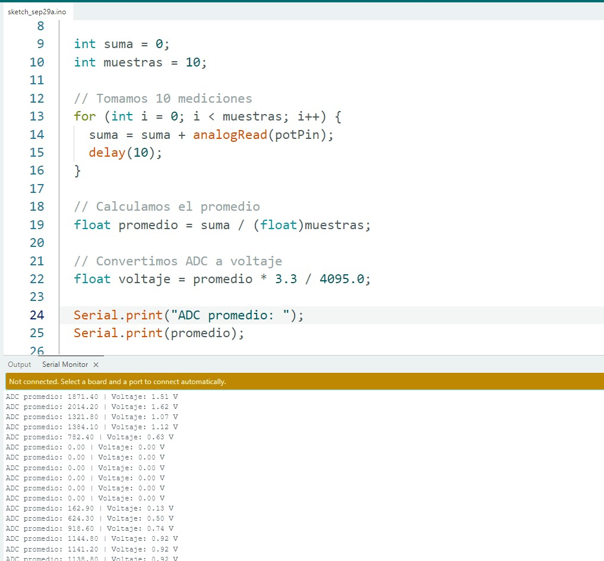
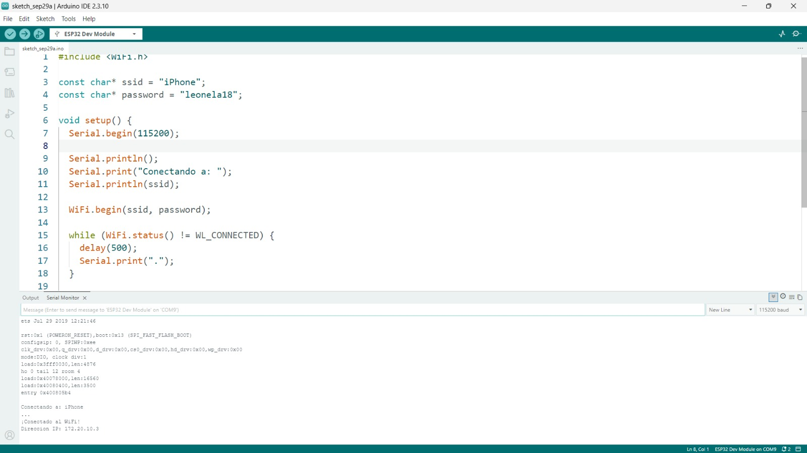
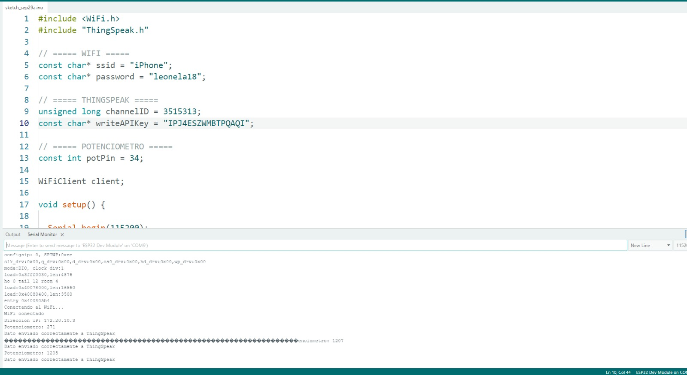
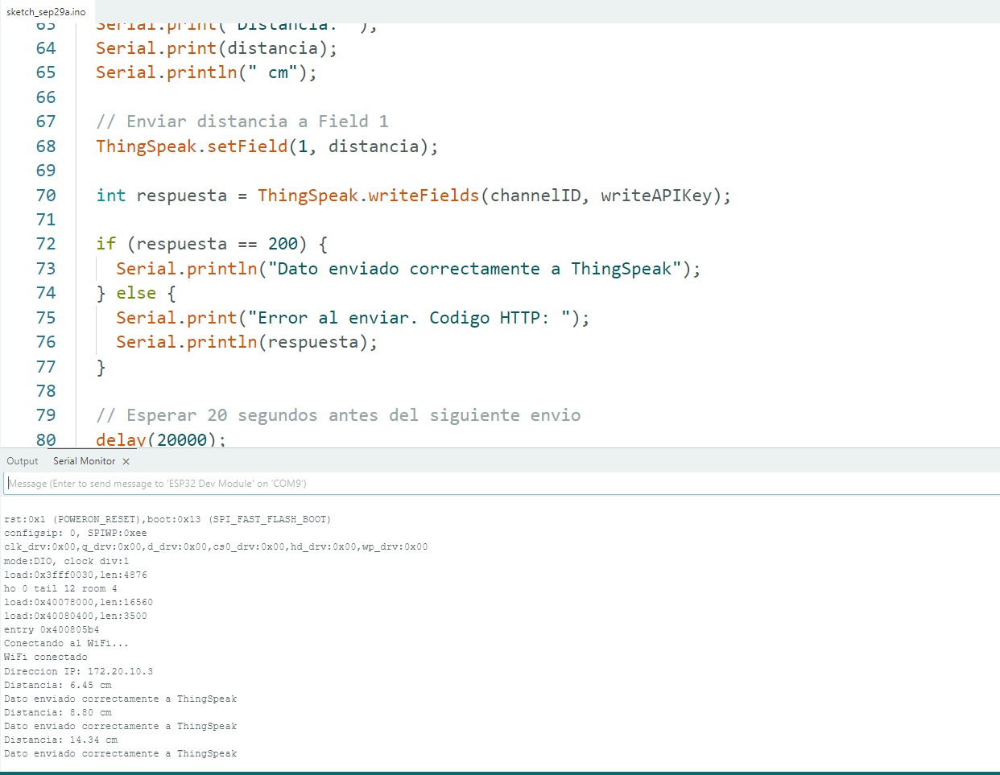
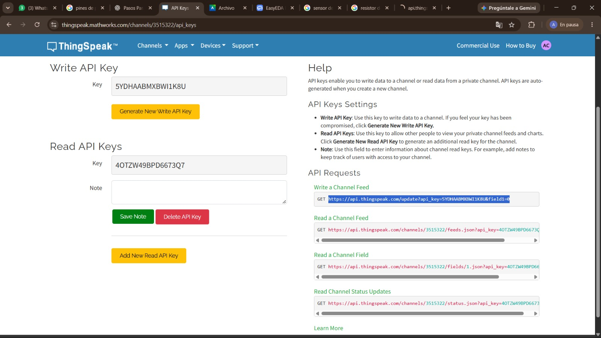

# Reporte de Actividades - Taller de Internet de las Cosas (IoT)
---

## Equipamiento y Herramientas Utilizadas
- **Microcontrolador:** ESP32 Dev Kit v1[cite: 1]
- **Sensores/Actuadores:** Potenciómetro, Kit de sensores Keystudio 48 en 1 (LM35, LDR, etc.), LED[cite: 1]
- **Entornos y Plataformas:** Arduino IDE / Cloud, Ubidots, ThingSpeak[cite: 1]
- **Protocolos e Infraestructura:** Wi-Fi (802.11 b/g/n), ADC de 12 bits, HTTP/REST, MQTT[cite: 1]

---

## 📋 Desarrollo y Análisis de las Actividades (1 a 5)

---

## Actividad 01: Lectura Analógica con Promediado y Conversión a Voltaje (ESP32)

#### **Descripción de la Actividad**
Se configuró una entrada analógica en el puerto GPIO del ESP32 para realizar lecturas filtradas mediante el método de promediado de 10 muestras continuas. Posteriormente, el valor promedio del convertidor analógico-digital (ADC) se escaló a su correspondiente valor de tensión en voltios.
**Código Fuente**
```
int potPin = 34;

void setup() {
  Serial.begin(115200);
}

void loop() {

  int suma = 0;
  int muestras = 10;

  // Tomamos 10 mediciones
  for (int i = 0; i < muestras; i++) {
    suma = suma + analogRead(potPin);
    delay(10);
  }

  // Calculamos el promedio
  float promedio = suma / (float)muestras;

  // Convertimos ADC a voltaje
  float voltaje = promedio * 3.3 / 4095.0;

  Serial.print("ADC promedio: ");
  Serial.print(promedio);

  Serial.print(" | Voltaje: ");
  Serial.print(voltaje);
  Serial.println(" V");

  delay(500);
}
```


###El promediado de las 10 muestras permite obtener una lectura más estable del potenciómetro. Al girarlo, el valor promedio del ADC aumenta o disminuye dependiendo de su posición física.

La conversión a voltaje permite interpretar la lectura de una forma más directa. La relación entre el valor del ADC y el voltaje calculado utiliza la referencia teórica del ESP32 para escalar la señal analógica entre 0V y 3.3V.

**Análisis**
La actividad permitió comprobar la lectura de una señal analógica utilizando el ESP32. El uso del promedio reduce las variaciones causadas por el ruido eléctrico y permite obtener valores más consistentes. Además, la conversión de la lectura digital a voltios facilita la interpretación directa de los datos obtenidos en el Monitor Serie.

#### **Resultado**
La técnica de promediado incrementa la precisión global del sistema de medición, estabilizando los datos presentados por el puerto serie antes de que sean procesados o transmitidos hacia la nube.

---

## Actividad 02: Escaneo de Redes e Interconexión Wi-Fi mediante Hotspot

#### **Descripción de la Actividad**
Se programó el módulo ESP32 en modo Estación (STA) para conectarse a un punto de acceso inalámbrico personal. El objetivo principal fue verificar el proceso de autenticación en la red y la obtención de una dirección IP dinámica válida mediante el protocolo DHCP.
**Código Fuente**
```
#include <WiFi.h>

const char* ssid = "iPhone";
const char* password = "leonela18";

void setup() {
  Serial.begin(115200);

  Serial.println();
  Serial.print("Conectando a: ");
  Serial.println(ssid);

  WiFi.begin(ssid, password);

  while (WiFi.status() != WL_CONNECTED) {
    delay(500);
    Serial.print(".");
  }

  Serial.println();
  Serial.println("¡Conectado al WiFi!");

  Serial.print("Direccion IP: ");
  Serial.println(WiFi.localIP());
}

void loop() {

}
```

La inicialización del módulo Wi-Fi permite al ESP32 autenticarse en la red local y solicitar una dirección IP pública/privada. Al restablecer el microcontrolador, el sistema intenta la conexión hasta confirmar el enlace exitoso.

La asignación de la dirección IP confirma que el ESP32 está correctamente integrado en la red local. Esto habilita al dispositivo para enviar y recibir datos a través de protocolos de internet en las siguientes actividades.

Análisis
La actividad permitió verificar la conectividad inalámbrica del ESP32 utilizando la librería WiFi.h. La impresión de los puntos de espera en el Monitor Serie ayuda a monitorear el proceso de enlace en tiempo real, mientras que la obtención de la dirección IP valida que el dispositivo cuenta con acceso a la red local.

Resultado
El ESP32 quedó configurado y conectado exitosamente a la red Wi-Fi, estableciendo la base de comunicación necesaria para la transmisión de telemetría hacia servicios IoT en la nube.

---

## Actividad 03: Telemetría en Tiempo Real del Potenciómetro a la Nube (Arduino Cloud, ThingSpeak, Ubidots)

#### **Descripción de la Actividad**
Se conectó el potenciómetro al ESP32 para enviar sus lecturas hacia la plataforma en la nube ThingSpeak a través de Wi-Fi. El objetivo fue aprender a mandar datos desde un sensor físico hacia un servidor web en tiempo real.
**Código Fuente**
```
#include <WiFi.h>
#include "ThingSpeak.h"

// ===== WIFI =====
const char* ssid = "iPhone";
const char* password = "leonela18";

// ===== THINGSPEAK =====
unsigned long channelID = 3515313;
const char* writeAPIKey = "IPJ4ESZWMBTPQAQI";

// ===== POTENCIOMETRO =====
const int potPin = 34;

WiFiClient client;

void setup() {

  Serial.begin(115200);

  pinMode(potPin, INPUT);

  // Conectar al WiFi
  WiFi.begin(ssid, password);

  Serial.print("Conectando al WiFi");

  while (WiFi.status() != WL_CONNECTED) {
    delay(500);
    Serial.print(".");
  }

  Serial.println();
  Serial.println("WiFi conectado");

  Serial.print("Direccion IP: ");
  Serial.println(WiFi.localIP());

  // Iniciar ThingSpeak
  ThingSpeak.begin(client);
}

void loop() {

  // Leer potenciometro
  int valorPot = analogRead(potPin);

  Serial.print("Potenciometro: ");
  Serial.println(valorPot);

  // Enviar valor al Field 1
  ThingSpeak.setField(1, valorPot);

  int respuesta = ThingSpeak.writeFields(channelID, writeAPIKey);

  if (respuesta == 200) {
    Serial.println("Dato enviado correctamente a ThingSpeak");
  } else {
    Serial.print("Error al enviar. Codigo HTTP: ");
    Serial.println(respuesta);
  }

  // Esperar antes del siguiente envio
  delay(20000);
}
```


El envío de los datos nos permite ver en pantalla la lectura que toma el potenciómetro y confirmar que llegó bien a la nube. Cada vez que giramos la perilla, la lectura cambia y el programa manda ese nuevo número al canal de ThingSpeak.

Para que el servidor acepte nuestros datos, fue necesario usar una clave única (API Key) y el número de canal. Además, tuvimos que poner un tiempo de espera de 20 segundos entre cada envío porque la plataforma gratuita no permite mandar datos muy seguido.

Análisis
Esta actividad nos ayudó a entender cómo funciona la telemetría en IoT. Aprendimos que no basta con leer el sensor en el microcontrolador, sino que usando internet y una librería especial (ThingSpeak.h) podemos guardar y consultar la información de nuestro circuito desde cualquier lugar a través de la web.

Resultado
Logramos enviar con éxito los valores del potenciómetro a la nube de ThingSpeak, verificando en el Monitor Serie que cada paquete de datos se transmite correctamente sin interrupciones.

---

## Actividad 04: Monitoreo Múltiple con Sensores del Kit Keystudio (LM35 / LDR)

#### **Descripción de la Actividad**
Se conectó un sensor ultrasónico HC-SR04 al ESP32 para medir la distancia a un objeto en centímetros y enviar automáticamente esos valores a la nube en ThingSpeak, comprobando que el servidor reciba la información correctamente.
**Código Fuente**
```
#include <WiFi.h>
#include "ThingSpeak.h"

// ===== WIFI =====
const char* ssid = "iPhone";
const char* password = "leonela18";

// ===== THINGSPEAK =====
unsigned long channelID = 3515313;
const char* writeAPIKey = "IPJ4ESZWMBTPQAQI";

// ===== SENSOR ULTRASONICO =====
const int trigPin = 5;
const int echoPin = 18;

WiFiClient client;

void setup() {

  Serial.begin(115200);

  // Configurar pines del HC-SR04
  pinMode(trigPin, OUTPUT);
  pinMode(echoPin, INPUT);

  // Conectar al WiFi
  WiFi.begin(ssid, password);

  Serial.print("Conectando al WiFi");

  while (WiFi.status() != WL_CONNECTED) {
    delay(500);
    Serial.print(".");
  }

  Serial.println();
  Serial.println("WiFi conectado");

  Serial.print("Direccion IP: ");
  Serial.println(WiFi.localIP());

  // Iniciar ThingSpeak
  ThingSpeak.begin(client);
}

void loop() {

  // Generar pulso ultrasónico
  digitalWrite(trigPin, LOW);
  delayMicroseconds(2);

  digitalWrite(trigPin, HIGH);
  delayMicroseconds(10);

  digitalWrite(trigPin, LOW);

  // Medir tiempo que demora en regresar el sonido
  long duracion = pulseIn(echoPin, HIGH, 30000);

  // Calcular distancia en centimetros
  float distancia = duracion * 0.0343 / 2;

  Serial.print("Distancia: ");
  Serial.print(distancia);
  Serial.println(" cm");

  // Enviar distancia a Field 1
  ThingSpeak.setField(1, distancia);

  int respuesta = ThingSpeak.writeFields(channelID, writeAPIKey);

  if (respuesta == 200) {
    Serial.println("Dato enviado correctamente a ThingSpeak");
  } else {
    Serial.print("Error al enviar. Codigo HTTP: ");
    Serial.println(respuesta);
  }

  // Esperar 20 segundos antes del siguiente envio
  delay(20000);
}
```


La medición de distancia nos permite calcular qué tan cerca o lejos está un objeto usando el tiempo que tarda el sonido en rebotar. Al mover la mano frente al sensor, vemos en el Monitor Serie cómo la distancia cambia en centímetros.

El código de respuesta HTTP 200 es la señal que nos da ThingSpeak para avisarnos que el dato llegó sin problemas a la plataforma. Si saliera otro número, sabríamos que hubo un error de conexión o de clave.

Análisis
En esta actividad aprendimos a trabajar con un sensor digital de ultrasonido y a interpretar las respuestas de un servidor web. Comprendimos que cuando el ESP32 hace una petición en la nube, el servidor nos devuelve un código (como el 200) para confirmarnos que los datos fueron guardados con éxito.

Resultado
Se logró medir la distancia en tiempo real e integrar el sensor HC-SR04 con ThingSpeak, confirmando el correcto envío de la información en cada intervalo mediante la respuesta HTTP 200.
---

## Actividad 05: Control Bidireccional Remoto de Actuador (LED) mediante Plataforma Web

#### **Descripción de la Actividad**
Se probó el envío de comandos desde un navegador web usando la API REST de ThingSpeak para cambiar el estado de un campo en la nube (field1) a 1 o 0, y así controlar de forma remota un LED conectado al ESP32.
<div align="center">

| Petición API (`field1=1`) | Respuesta del Servidor | Circuito Actuador LED |
| :---: | :---: | :---: |
|  |  |  |

</div>

| Encendido del LED|


Enlace de la API (Petición Web)
---
**https://api.thingspeak.com/update?api_key=5YDHAABMXBWI1K8U&field1=1**
---


Al escribir la dirección de la API en el navegador web con el valor field1=1 o field1=0, le enviamos una instrucción directa a ThingSpeak. El número que responde la página (como un 4 o 5) indica el número total de mensajes o comandos guardados en el canal.

En el circuito físico, conectamos un LED con su resistencia al pin de salida del ESP32. De esta forma, cuando el microcontrolador lee el valor almacenado en la nube, enciende o apaga el LED según la orden enviada desde la web.

Análisis
Esta actividad nos enseñó que IoT no solo sirve para leer sensores, sino también para controlar cosas a distancia. Aprendimos a usar enlaces de API REST desde el navegador para mandar órdenes hacia la nube y lograr que un componente físico (como un LED) responda a esos comandos.

Resultado
Se logró probar el control bidireccional en ThingSpeak, cambiando el estado del canal mediante peticiones HTTP para la posterior activación y desactivación del actuador en la placa.
