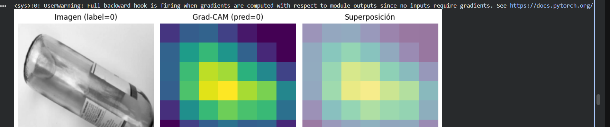

# Redes Neuronales: CNN, Keras y Perceptrón

## CNN (Red Neuronal Convolucional)

Una **CNN** es un tipo de red neuronal diseñada principalmente para trabajar con **imágenes**. Aprende automáticamente características como bordes, formas y texturas.

**¿Para qué sirve?**

Se utiliza principalmente para **reconocer y clasificar imágenes**, detectar objetos o identificar patrones visuales. En este trabajo se aplica para diferenciar imágenes de **vidrio y plástico**.

## Keras

**Keras** es una herramienta que permite **crear, entrenar y evaluar redes neuronales** de una manera más sencilla.

**¿Para qué sirve?**

Facilita la construcción de modelos de aprendizaje profundo, permitiendo agregar capas, funciones de activación y métodos para mejorar el entrenamiento. En este trabajo se utiliza para realizar **clasificación de reseñas**.

## Perceptrón

El **perceptrón** es uno de los modelos más básicos de una red neuronal. Recibe diferentes datos de entrada, les asigna pesos y genera una salida.

**¿Para qué sirve?**

Se utiliza principalmente para realizar **clasificaciones o decisiones sencillas**. En este trabajo se aplica a un ejemplo de **detección de sobrecalentamiento mediante temperatura y vibración**.

# CNN

## Código importante

## Código importante

## Importancia y función del código

Este código permite seleccionar una imagen del conjunto de prueba y analizar la predicción realizada por la CNN mediante Grad-CAM.

La línea más importante es:

`cam, pred_class = grad_cam(resnet, x)`

Esta línea aplica Grad-CAM al modelo ResNet. `cam` genera un mapa de calor que muestra las zonas de la imagen que más influyeron en la decisión, mientras que `pred_class` indica la clase predicha por el modelo.

Su importancia está en que permite conocer la predicción de la CNN y visualizar qué partes de la imagen fueron más importantes para tomar esa decisión.

## Resultado obtenido

## Interpretación

La imagen presenta tres resultados: la imagen original, el mapa Grad-CAM y la superposición.

La imagen original tiene una etiqueta real igual a `0`. El modelo también realizó una predicción igual a `0`, por lo que la clasificación coincide con la etiqueta real.

En el mapa Grad-CAM, las zonas amarillas y verdes representan las regiones que tuvieron mayor influencia en la predicción. Se observa que el modelo concentra principalmente su atención en la zona central del objeto.

La superposición permite visualizar directamente sobre la imagen las regiones que la CNN consideró más importantes para realizar la clasificación.
